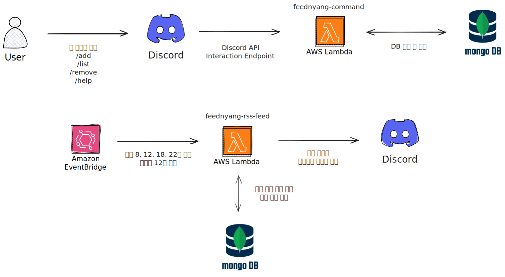

# 피드냥


## 프로젝트 개요

기술 블로그의 RSS 피드를 스케줄링을 통해 디스코드 채널에 전송해주는 디스코드 봇입니다. MongoDB를 활용해 중복된 피드를 검증하고, 등록된 채널들을 확인해서 메시지를 전송합니다. 그리고 피드 추가, 목록 조회, 삭제 명령어를 제공합니다.

## 기술 스택

- **Languages**: TypeScript (Pulumi), Go (Lambda functions)
- **Infrastructure**: AWS (Lambda, EventBridge) managed by Pulumi
- **Database**: MongoDB

## 아키텍처 다이어그램



- **Lambda**: RSS 피드 수집, 중복 제거 후 디스코드 봇에게 메시지 전파
- **EventBridge**: 한국 시간 기준으로 평일 08, 12, 18, 22시, 토요일 12시에 Lambda 함수 호출
- **MongoDB**: 채널의 피드 목록 조회, 중복된 기술 블로그 피드 확인

## Getting Started

### 사전 요구사항

- Pulumi CLI (>= v3): https://www.pulumi.com/docs/get-started/install/
- Node.js (>= 14): https://nodejs.org/
- Bun: https://bun.sh/docs/installation
- AWS credentials configured (e.g., via `aws configure` or environment variables)
- MongoDB connection string
- Discord Developer Portal에서 디스코드 봇 생성 후, 봇 토큰 및 APP ID 취득
   - https://discord.com/developers/docs/intro

### 설치 및 배포

1. 의존성 설치:
   ```bash
   bun install
   ```

2. Pulumi 설정:
   ```bash
   pulumi config set aws:region ap-northeast-2
   pulumi config set default-discord-channel-ids <your-discord-channel-id>
   pulumi config set discord-bot-token <your-discord-bot-token> --secret
   pulumi config set mongodb-uri <your-mongodb-connection-string> --secret
   ```

3. 인프라 배포 미리보기:
   ```bash
   pulumi preview
   ```

4. 인프라 배포:
   ```bash
   pulumi up
   ```

5. Discord 슬래시 커맨드 등록:
   - [Discord 슬래시 커맨드 등록 가이드](./docs/discord-command-setup.md)를 참고하여 봇 커맨드를 등록

6. 인프라 제거 (필요한 경우):
   ```bash
   pulumi destroy
   ```
